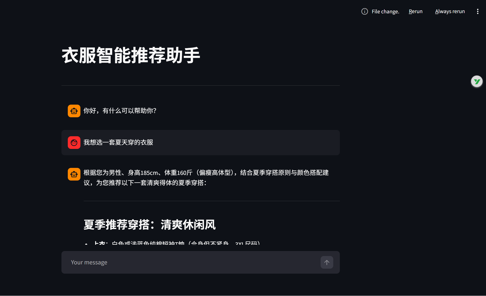
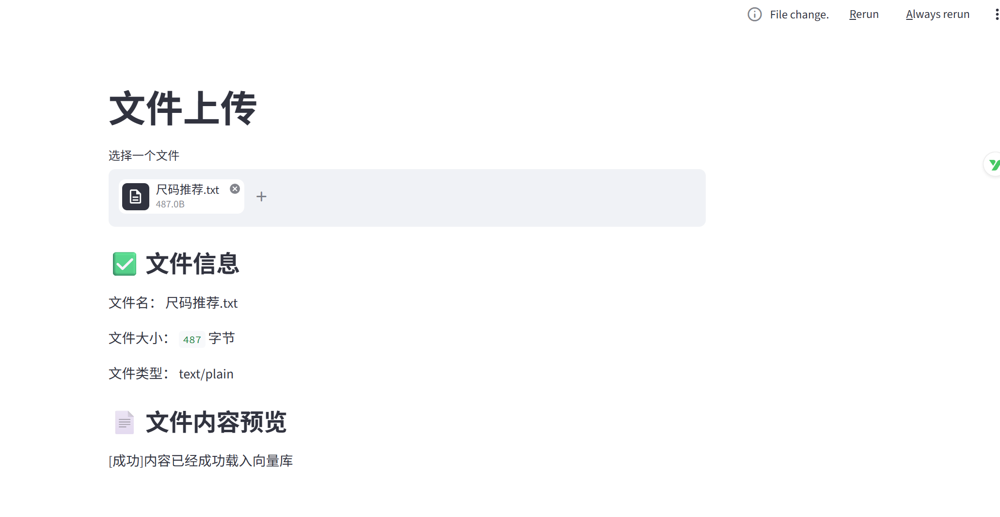
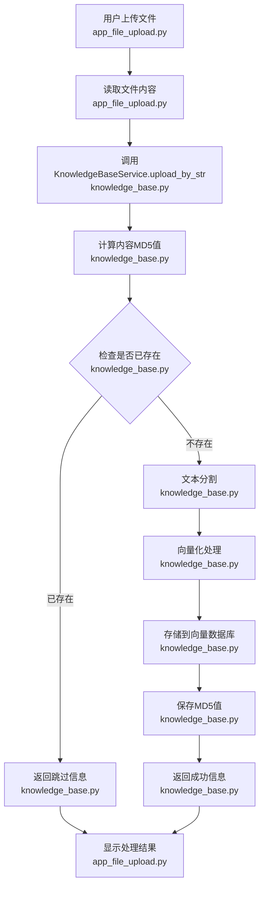
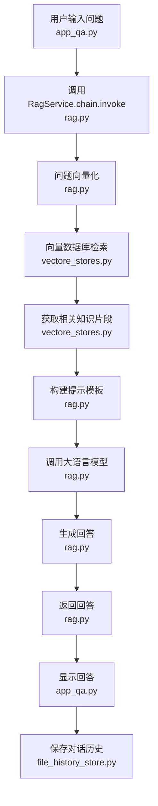
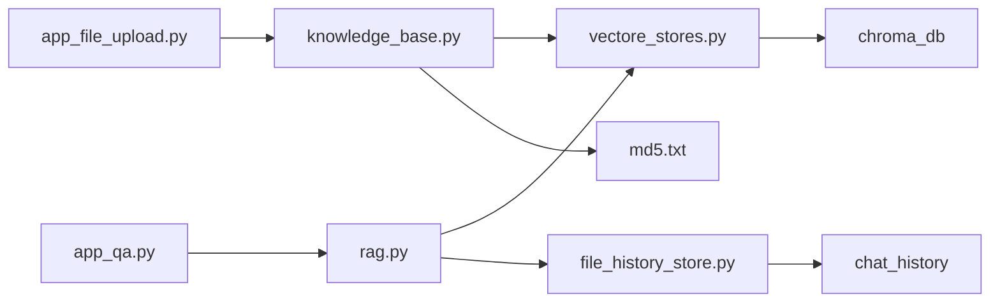

# 服装智能推荐助手（Smart Clothing Recommendation Assistant）

## 项目简介

服装智能推荐助手是一个基于RAG（Retrieval-Augmented Generation）技术的智能问答系统，专为服装相关问题提供专业、个性化的建议。该系统能够根据用户的身高、体重、偏好等信息，提供精准的服装推荐和搭配建议，同时回答关于服装保养、搭配技巧等问题。

## 页面展示
### 问答页面


### 上传文件页面


## 核心功能

- **智能问答**：基于大语言模型和知识库，提供专业的服装相关问题解答
- **个性化推荐**：根据用户提供的信息（如身高、体重、风格偏好等）推荐合适的服装
- **服装保养指南**：提供各类服装的保养方法和注意事项
- **知识库管理**：支持上传和管理服装相关的知识文档
- **对话历史记录**：保存用户的对话历史，提供上下文相关的回答

## 技术栈

- **前端**：Streamlit
- **后端**：Python 3.13+
- **RAG框架**：LangChain
- **向量数据库**：Chroma
- **嵌入模型**：DashScope Embeddings (text-embedding-v4)
- **对话模型**：ChatTongyi (Qwen3-max)

## 快速开始

### 环境准备

1. 确保安装了 Python 3.13 或更高版本
2. 安装依赖：

```bash
pip install -r requirements.txt
```

### 配置设置

1. 在 `rag/config_data.py` 文件中配置：
   - `DASHSCOPE_API_KEY`：阿里云 DashScope API 密钥
   - 其他配置参数（如模型名称、向量数据库设置等）

### 运行应用

1. 启动文件上传服务：

```bash
streamlit run rag/app_file_upload.py
```

2. 启动问答服务：

```bash
streamlit run rag/app_qa.py
```

### 使用方法

1. **上传知识库**：
   - 通过文件上传服务上传服装相关的文档
   - 系统会自动处理并存储到向量数据库

2. **智能问答**：
   - 在问答服务中输入您的问题，例如：
     - "我的身高185cm,体重180斤，尺码推荐"
     - "棉裤如何保养？"
     - "夏天职场穿搭建议"
   - 系统会基于知识库和大语言模型提供专业回答

## 项目结构

```
SCRA/
├── rag/
│   ├── chat_history/       # 对话历史存储
│   ├── chroma_db/          # 向量数据库
│   ├── app_file_upload.py  # 文件上传应用
│   ├── app_qa.py           # 问答应用
│   ├── config_data.py      # 配置文件
│   ├── file_history_store.py # 文件历史存储
│   ├── knowledge_base.py   # 知识库服务
│   ├── rag.py              # RAG服务
│   └── vectore_stores.py   # 向量存储服务
├── main.py                 # 项目入口
└── pyproject.toml          # 项目配置文件
```

## 核心文件说明

### 1. 知识库相关文件

#### knowledge_base.py
- **功能**：实现知识库的上传、存储和管理
- **重要方法**：
  - `KnowledgeBaseService.upload_by_str(data, filename)`：将文本数据上传到向量数据库
  - `get_str_md5(input_str)`：计算字符串的MD5值，用于去重
  - `check_md5(md5_str)`：检查内容是否已存在于知识库
  - `save_md5(md5_str)`：保存已处理内容的MD5值

#### vectore_stores.py
- **功能**：提供向量数据库的操作接口
- **重要方法**：
  - `VectorStoreService.get_retriever()`：返回向量检索器，用于在问答链中检索相关知识

### 2. 问答相关文件

#### rag.py
- **功能**：实现RAG服务，整合检索和生成功能
- **重要方法**：
  - `RagService.__get_chain()`：构建问答链，整合检索和生成功能
  - `get_history(session_id)`：获取对话历史

#### app_qa.py
- **功能**：提供用户交互界面，处理用户提问并展示回答
- **重要流程**：
  - 初始化RAG服务
  - 处理用户输入
  - 调用RAG服务生成回答
  - 展示对话历史

### 3. 文件上传相关文件

#### app_file_upload.py
- **功能**：提供文件上传界面，处理文件上传和知识库更新
- **重要流程**：
  - 接收用户上传的文件
  - 读取文件内容
  - 调用知识库服务上传内容
  - 显示处理结果

### 4. 配置文件

#### config_data.py
- **功能**：存储系统配置参数
- **重要配置**：
  - `DASHSCOPE_API_KEY`：阿里云DashScope API密钥
  - `collection_name`：向量数据库集合名称
  - `persist_directory`：向量数据库存储目录
  - `chunk_size`、`chunk_overlap`：文本分割参数
  - `chat_model_name`、`embedding_model_name`：模型名称

## 流程说明

### 1. 知识上传流程



### 2. 问答流程



### 3. 文件关联关系



## 系统架构

### 1. 知识库层
- **向量数据库**：基于 Chroma 实现，用于存储服装相关知识的向量表示
- **文本处理**：使用 RecursiveCharacterTextSplitter 进行智能文本分割，支持自定义分割参数
- **向量化**：使用 DashScope Embeddings (text-embedding-v4) 将文本转换为向量
- **知识去重**：通过 MD5 哈希值检测重复内容，避免知识库冗余

### 2. 服务层
- **RAG 服务**：
  - 整合检索和生成功能，实现知识增强的问答能力
  - 使用 LangChain 构建问答链，支持上下文管理
  - 基于相似度阈值的知识检索，确保回答的相关性
- **知识库服务**：
  - 管理知识的上传、存储和更新
  - 处理文件内容的向量化和存储
  - 维护知识的元数据信息
- **向量存储服务**：
  - 提供向量数据库的操作接口
  - 实现高效的向量检索功能

### 3. 应用层
- **文件上传应用**：
  - 基于 Streamlit 实现的文件上传界面
  - 支持多种文件类型的上传和处理
  - 提供文件信息预览和处理状态反馈
- **问答应用**：
  - 基于 Streamlit 实现的聊天界面
  - 支持实时对话和流式回答
  - 维护用户对话历史，提供上下文相关的回答

### 4. 数据流向
1. **知识上传流程**：
   - 用户上传文件 → 文件内容读取 → 文本分割 → 向量化处理 → 存储到向量数据库
2. **问答流程**：
   - 用户提问 → 问题向量化 → 向量数据库检索 → 知识片段获取 → 大语言模型生成回答 → 返回给用户

## 技术特点

### 1. RAG 技术实现
- **检索增强生成**：结合向量检索和大语言模型，提供基于知识的准确回答
- **上下文管理**：使用 RunnableWithMessageHistory 实现对话历史管理，确保回答的连贯性
- **模板化提示**：使用 ChatPromptTemplate 构建结构化提示，提高回答质量

### 2. 向量数据库技术
- **高效存储**：Chroma 向量数据库支持本地持久化存储，适合中小规模知识库
- **快速检索**：基于余弦相似度的近似最近邻搜索，实现毫秒级响应
- **元数据过滤**：支持基于元数据的检索过滤，提高检索精度

### 3. 文本处理技术
- **智能分割**：RecursiveCharacterTextSplitter 支持根据不同分隔符进行分层分割
- **重叠处理**：通过 chunk_overlap 参数确保分割文本的上下文连续性
- **长度控制**：通过 chunk_size 参数控制分割文本的长度，优化向量化效果

### 4. 对话管理技术
- **会话状态管理**：使用 Streamlit 的 session_state 管理用户会话
- **历史记录存储**：通过 FileChatMessageHistory 实现对话历史的持久化存储
- **流式输出**：支持生成式回答的流式输出，提升用户体验

### 5. 系统优化
- **重复内容检测**：基于 MD5 哈希值的内容去重，避免知识库冗余
- **并发处理**：支持多用户同时访问，通过会话隔离确保数据安全
- **错误处理**：完善的错误处理机制，确保系统稳定运行

## 示例问答

### 问题：我的身高185cm,体重180斤，尺码推荐

**回答**：根据您的身高185cm和体重180斤的情况，您属于偏壮实的体型。以下是一些尺码推荐建议：

1. **上衣**：建议选择XL或XXL码，具体取决于品牌的版型。如果喜欢修身款，可以选择XL；如果喜欢宽松舒适的感觉，建议选择XXL。

2. **裤子**：腰围可能在34-36英寸之间，建议选择34或36码的裤子。如果是牛仔裤，可能需要选择36码以确保舒适。

3. **外套**：同样建议选择XL或XXL码，确保肩宽和胸围有足够的空间。

4. **购买建议**：不同品牌的尺码标准可能略有差异，建议参考具体品牌的尺码表，并在可能的情况下试穿。如果网购，可以查看其他买家的评价，特别是与您体型相似的买家反馈。

### 问题：棉裤如何保养？

**回答**：棉裤的保养方法如下：

1. **洗涤**：
   - 建议手洗或机洗选择轻柔模式
   - 使用中性洗涤剂，避免使用漂白剂
   - 水温不宜过高，建议30℃以下
   - 翻面洗涤，减少摩擦对表面的损伤

2. **晾晒**：
   - 避免阳光直射，选择通风阴凉处晾干
   - 平铺晾晒或悬挂晾干，避免拉伸变形
   - 完全晾干后再收纳

3. **储存**：
   - 清洗干净后再储存
   - 折叠整齐，放入衣物收纳袋
   - 放置樟脑丸等防虫剂，但要避免直接接触衣物
   - 定期拿出来通风，防止受潮

4. **其他注意事项**：
   - 避免长时间浸泡
   - 熨烫时温度不宜过高，建议使用中低温
   - 如有污渍，及时处理，避免污渍固化

## 未来规划

- 增加用户个性化配置功能
- 集成更多服装品牌的尺码数据
- 开发移动应用版本
- 增加图像识别功能，支持上传服装照片获取搭配建议
- 构建社区功能，允许用户分享搭配心得

## 贡献指南

欢迎对本项目提出建议和贡献！如果您有任何问题或建议，请通过以下方式联系我们：

- 提交 Issue
- 发送 Pull Request
- 联系项目维护者

## 许可证

本项目采用 MIT 许可证。

---

**衣服智能推荐助手** - 让您的穿搭更自信，更时尚！
